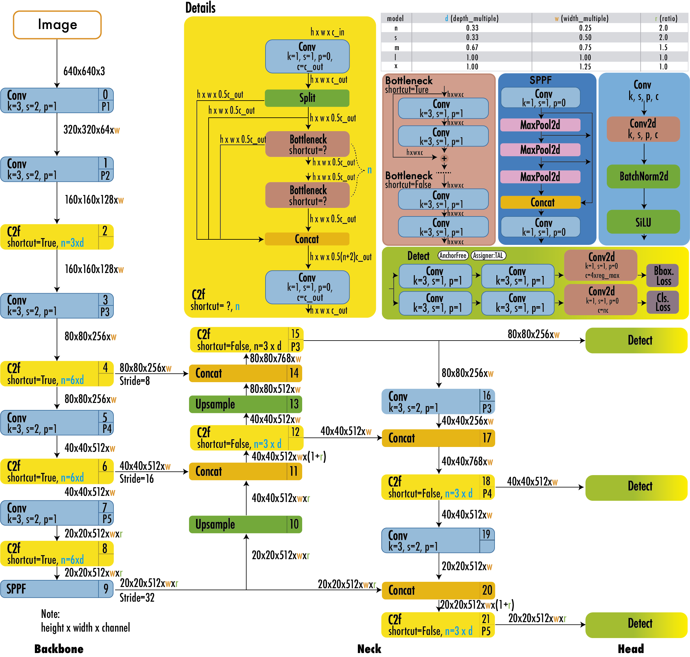

# YOLO from Scratch

## Overview
This project implements a YOLO object detection model from scratch using PyTorch. It supports COCO-format datasets and includes modern augmentation techniques like mosaic and mixup.

## Features
- Modular model architecture (backbone, neck, head)
- Mosaic and mixup augmentation
- Training and evaluation scripts
- Configurable hyperparameters via `utils/hyperparams.yaml`
- COCO to YOLO conversion utility

## Training on COCO Dataset

### Step 1: Prepare COCO Data
- Download the COCO dataset (images and annotations) from [COCO official site](https://cocodataset.org/#download).
- Use `data/data_conversion.py` to convert COCO annotations (`instances_train2017.json`, `instances_val2017.json`) to YOLO format. This will generate label `.txt` files and image lists.
- Organize your data as follows:
  - Images: `data/coco/train2017/images/`, `data/coco/val2017/images/`
  - Labels: `data/coco/train2017/labels`, `data/coco/val2017/labels/`
  - Image lists: `data/coco/instances_train2017.txt`, `data/coco/instances_val2017.txt`

### Step 2: Configure Hyperparameters
- Edit `utils/hyperparams.yaml` to adjust training parameters (learning rate, augmentation, etc.) and class names.

### Step 3: Start Training
Run:
```bash
python train_yolo_on_coco.py
```
- The script loads the COCO training images and labels, applies augmentations (including mosaic and mixup), and trains the YOLO model from scratch.
- Model checkpoints and logs are saved in `runs/train/`.

### Step 4: Monitor and Evaluate
- Check `runs/train/` for saved models and logs.
- You can modify the script to add validation or evaluation on the COCO validation set.

## Architecture



## File Structure
```
yolo-from-scratch/
├── models/
│   ├── model.py
│   ├── backbone.py
│   ├── neck.py
│   ├── head.py
│   └── yolo_model_backbone.py
├── data/
│   ├── data.py
│   └── data_conversion.py
├── utils/
│   ├── util.py
│   ├── print_visualize.py
│   └── hyperparams.yaml
├── train_yolo_on_coco.py
├── README.md
└── ...
```

## License
MIT